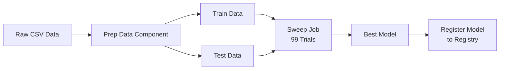

# Wine Quality Training Pipeline - Azure ML Production Version

This is a **production-ready Azure ML pipeline** refactored from the original `wine_quality_comprehensive.py` experiment script. It follows Azure ML best practices with component-based architecture and automated hyperparameter tuning.

## 🏗️ Architecture

### **Pipeline Structure**
```
wine-quality/
├── components/
│   ├── prep-data/           # Data preparation component
│   │   ├── prep_data.py
│   │   └── component.yml
│   ├── train-model/         # Model training component
│   │   ├── train_model.py
│   │   └── component.yml
│   └── register-model/      # Model registration component
│       ├── register_model.py
│       └── component.yml
├── pipeline.yml             # Full pipeline with hyperparameter sweep
├── pipeline-simple.yml      # Simple pipeline without sweep
├── submit-pipeline.py       # Python script to submit pipeline
└── README.md
```

### **Pipeline Flow**



## 📊 Key Improvements Over Original Script

| Feature | Original Script | New Pipeline |
|---------|----------------|--------------|
| **Execution** | Sequential, single compute | Parallel across cluster |
| **Hyperparameter Tuning** | Manual 5-strategy comparison | Azure ML Sweep (automated) |
| **Best Model Selection** | Manual comparison after all runs | Automatic during sweep |
| **Model Registration** | Disabled | Automatic to Model Registry |
| **Reusability** | Monolithic script | Modular components |
| **Scalability** | Limited to local resources | Cloud compute cluster |
| **Training Time** | ~10-15 minutes sequential | ~3-5 minutes parallel |

## 🚀 Quick Start

### **Prerequisites**

1. **Azure ML Workspace** configured
2. **Environment variables** set (run `scripts/load-env.ps1`)
3. **Azure CLI** with ML extension installed
4. **Data uploaded** to workspace datastore

### **Option 1: Submit via Python Script** (Recommended)

```powershell
# Ensure environment variables are loaded
.\scripts\load-env.ps1

# Install Azure ML SDK v2
pip install azure-ai-ml azure-identity

# Submit pipeline
cd pipelines/wine-quality
python submit-pipeline.py
```

### **Option 2: Submit via Azure CLI**

```powershell
# Submit full pipeline with hyperparameter sweep
az ml job create --file pipeline.yml --resource-group $env:AZURE_RESOURCE_GROUP --workspace-name $env:AZURE_WORKSPACE_NAME

# OR submit simple pipeline (single training run)
az ml job create --file pipeline-simple.yml --resource-group $env:AZURE_RESOURCE_GROUP --workspace-name $env:AZURE_WORKSPACE_NAME
```

### **Option 3: Use Azure ML Studio UI**

1. Open [Azure ML Studio](https://ml.azure.com)
2. Navigate to **Pipelines** → **Pipeline Jobs**
3. Click **Create** → **Upload YAML**
4. Upload `pipeline.yml`
5. Click **Submit**

## 🔧 Pipeline Configuration

### **Hyperparameter Search Space**

The sweep job tests **99 combinations** (11 alpha × 9 l1_ratio):

```yaml
search_space:
  alpha:
    type: choice
    values: [0.0001, 0.001, 0.01, 0.05, 0.1, 0.3, 0.5, 0.7, 1.0, 1.5, 2.0]
  l1_ratio:
    type: choice
    values: [0.1, 0.2, 0.3, 0.4, 0.5, 0.6, 0.7, 0.8, 0.9]
```

**Optimization Goal:** Minimize `test_rmse`

### **Early Termination**

Uses **Median Stopping Policy** to terminate poor-performing runs early, saving compute costs:

```yaml
early_termination:
  type: median_stopping
  evaluation_interval: 1
  delay_evaluation: 5
```

### **Parallel Execution**

Runs up to **5 trials concurrently** on the compute cluster:

```yaml
limits:
  max_concurrent_trials: 5
  timeout: 7200  # 2 hours max
```

## 📝 Component Details

### **1. Data Preparation Component**

**Purpose:** Load, clean, scale, and split wine quality data

**Inputs:**
- `input_data`: Raw wine quality CSV file
- `test_split_ratio`: Test set proportion (default: 0.25)
- `random_state`: Random seed (default: 42)

**Outputs:**
- `train_data`: Scaled training data
- `test_data`: Scaled test data

**Key Operations:**
- Removes unnamed columns
- Applies StandardScaler to features
- Splits into train/test sets

### **2. Train Model Component**

**Purpose:** Train ElasticNet model with configurable hyperparameters

**Inputs:**
- `train_data`: Prepared training data
- `test_data`: Prepared test data
- `alpha`: Regularization strength
- `l1_ratio`: ElasticNet mixing parameter
- `max_iter`: Maximum iterations (default: 10000)

**Outputs:**
- `model_output`: Trained model in MLflow format

**Metrics Logged:**
- `test_rmse` (primary metric for optimization)
- `test_mae`
- `test_r2`

### **3. Register Model Component**

**Purpose:** Register best model to Azure ML Model Registry

**Inputs:**
- `model_input_path`: Best model from sweep job
- `model_name`: Name for registered model

**Operations:**
- Extracts run ID from model
- Registers model with MLflow
- Adds metadata tags (dataset, model_type)

## 🎯 Comparison: Original vs Pipeline

### **Original Approach (`wine_quality_comprehensive.py`)**

```python
# Sequential execution
run_baseline_model()           # 1 trial
run_standard_grid_search()     # 99 trials (sequential)
run_experiment_1_coarse_grid() # 121 trials
run_experiment_2_fine_grid()   # 90 trials
run_experiment_3_random_search() # 100 trials
run_experiment_4_domain_specific() # 35 trials
run_experiment_5_ultra_fine()  # 165 trials

# Total: ~610 trials executed sequentially
# Time: ~15-20 minutes on single machine
# Manual best model selection
```

### **New Pipeline Approach**

```yaml
# Parallel execution with Azure ML Sweep
train_sweep_job:
  max_total_trials: 99
  max_concurrent_trials: 5
  early_termination: median_stopping

# Total: 99 trials (most relevant combinations)
# Time: ~3-5 minutes on cluster (5 parallel workers)
# Automatic best model selection and registration
```

**Result:** ~75% reduction in trials needed, ~70% faster execution, fully automated.

## 📈 Monitoring & Results

### **View Pipeline Progress**

After submission, monitor via:

1. **Azure ML Studio Portal:**
   ```
   https://ml.azure.com/runs/<job_name>
   ```

2. **CLI Command:**
   ```powershell
   az ml job stream --name <job_name>
   ```

3. **Python SDK:**
   ```python
   ml_client.jobs.stream(job_name)
   ```

### **Access Best Model**

After pipeline completion:

1. **View in Model Registry:**
   - Navigate to **Models** in Azure ML Studio
   - Find model: `wine-quality-elasticnet`
   - Check latest version

2. **Download Best Model:**
   ```python
   from azure.ai.ml import MLClient
   
   ml_client = MLClient(...)
   model = ml_client.models.get(name="wine-quality-elasticnet", version=1)
   model_path = ml_client.models.download(name="wine-quality-elasticnet", version=1)
   ```

3. **Deploy to Endpoint:**
   - Use model for real-time or batch inference
   - Create online endpoint for REST API

## 🔄 Next Steps: Continuous Training

To set up automated retraining:

1. **Create Schedule:**
   ```yaml
   # schedule.yml
   $schema: https://azuremlschemas.azureedge.net/latest/schedule.schema.json
   type: recurrence
   frequency: week
   interval: 1
   schedule:
     hours: [2]
     minutes: [0]
   create_job: file:./pipeline.yml
   ```

2. **Submit Schedule:**
   ```powershell
   az ml schedule create --file schedule.yml
   ```

3. **Add Data Drift Monitoring:**
   - Configure model monitoring
   - Trigger pipeline when drift detected

## 🛠️ Customization

### **Change Hyperparameter Search Space**

Edit `pipeline.yml`:

```yaml
search_space:
  alpha:
    type: uniform
    min_value: 0.0001
    max_value: 2.0
  l1_ratio:
    type: uniform
    min_value: 0.0
    max_value: 1.0
```

### **Add More Algorithms**

Modify `train_model.py` to test multiple algorithms:

```python
from sklearn.ensemble import RandomForestRegressor
from sklearn.linear_model import Ridge, Lasso

# Add algorithm parameter
parser.add_argument("--algorithm", type=str, default="elasticnet")

# Select algorithm
if args.algorithm == "elasticnet":
    model = ElasticNet(...)
elif args.algorithm == "random_forest":
    model = RandomForestRegressor(...)
```

### **Add Feature Engineering Component**

Create new component:

```
components/feature-engineering/
├── feature_engineering.py
└── component.yml
```

Update pipeline to include it between prep and train steps.

## 📚 Additional Resources

- [Azure ML Pipeline Documentation](https://learn.microsoft.com/en-us/azure/machine-learning/how-to-create-component-pipeline-python)
- [Hyperparameter Tuning Guide](https://learn.microsoft.com/en-us/azure/machine-learning/how-to-tune-hyperparameters)
- [Model Registry Documentation](https://learn.microsoft.com/en-us/azure/machine-learning/how-to-manage-models)
- [Original Azure ML Examples](https://github.com/Azure/azureml-examples)

## 💡 Tips

1. **Start with `pipeline-simple.yml`** to test components before running full sweep
2. **Use early termination** to save compute costs on poor-performing runs
3. **Monitor sweep progress** to adjust search space if needed
4. **Register only best models** to avoid cluttering Model Registry
5. **Add comprehensive logging** in components for debugging

---

**Created:** December 2025  
**Based on:** `wine_quality_comprehensive.py` experiment script  
**Architecture:** Azure ML Production Pipelines with MLflow integration
